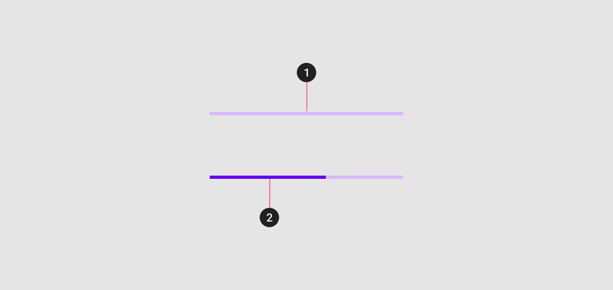
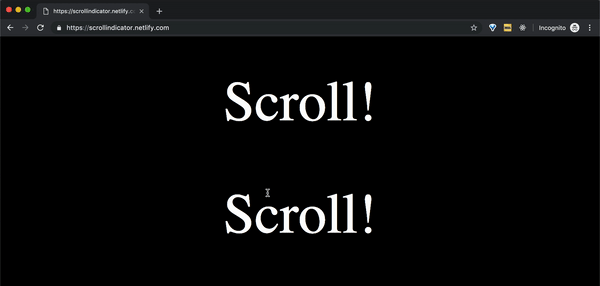

<br/>

**Scroll Indicator** is basically a line which fills up based on how much the user has scrolled in the page.They are usually positioned at the Top of the page.


**Output:**

Checkout the output [here](https://scrollindicator.netlify.com/)



##Let's get to Coding:


```jsx
<body>
 <div class="line" id="scrollIndicator"></div>
 <div>
   // ... some code
 </div>
</body>
```

All we did in the above snippet was adding a small scrollIndicator `<div>`.

Before we jump into how we can implement scroll indicator it is necessary to understand few `window` properties related to scrolling.

```css
.line {
      background: #038eff;
      height: 5px;
      border-radius: 3px;
      width: 0%;
      position: fixed;
      top: 0;
    }
```
Above shows the CSS required for plotting the line. It should initially be at width 0. Then increase it based on the percentage of scroll.


##Window's Scroll related Properties:
* `window.innerHeight` - Height of the viewable portion of the browser.(Eg: 640)
* `document.body.scrollHeight` - Height of the entire webPage.
* `window.scrollY` - how many pixels the user has scrolled down so far. It is `0` on **page load** and it increases as the user scrolls down.


```js
const scrollIndicatorElt = document.getElementById('scrollIndicator');
const maxScrollableHeight = document.body.scrollHeight - window.innerHeight;
window.addEventListener('scroll', moveScrollIndicator);
```
* Get the `scrollIndicator` node by its id.The Scroll line appears in this element.
* Find `maxScrollableHeight` which specifies the number of pixels the user can scroll.To identify this we find the difference between `document.body.scrollHeight` and `window.innerHeight`
* Attach an Event listener to `scroll`.

```js
function moveScrollIndicator() {
  const percentage = ((window.scrollY) / maxScrollableHeight) * 100;
  scrollIndicatorElt.style.width = percentage + '%';
}
```

* `moveScrollIndicator` function gets executed when scroll event is fired.
* `percentage` is the width of the `scrollIndicator` element. 
* `percentage` is calculated as the ratio of **Pixels scrolled(`window.scrollY`)** by the user to **total Scrollable Pixels (maxScrollableHeight)**


Check the output [here](https://scrollindicator.netlify.com/). [Repo Link](https://github.com/dhilipkmr/scrollIndicator)


My [Website](https://www.dhilipkmr.dev), [blogs](https://dev.to/dhilipkmr) and [Twitter](https://twitter.com/dhilipkmr_)

That's All Folks!
