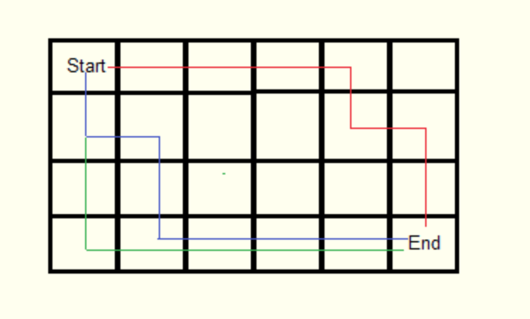
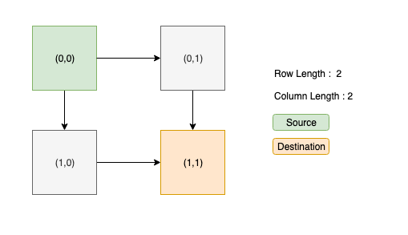

<br/>

###PROBLEM STATEMENT:

 - Given the length of Row and Column of a 2D matrix.
 - Starting from origin (0,0), find the maximum number of Paths one can take to reach the last index.
 - Allowed ways to move => Right and Bottom.

Example:

 - Let, row's length and column length be (2, 2)
 - Starting from (0,0) one should reach (1,1)
 - So the number of paths for that are: 2



Path 1: (0,0) -> (0,1) -> (1,1)
Path 2: (0,0) -> (1,0) -> (1,1)


##Thought Process:

###Checking for a Pattern:
 - We are allowed to traverse in two ways Down and Right for every Index. So this is a pattern.

###Edge Cases:
 - While we iterate we need to be careful about the ending index's count and so we should handle those cases.
 - Path is 0 when the input is less than 1 for either row or column.

We found a pattern to go through for every index we can choose to solve with iteration / recursion.

Here we will solve it through RECURSION!


```jsx
const num_of_paths = findMaxPathSrcToDes(3, 3);
console.log('Number of Paths', num_of_paths);
```

We call `findMaxPathSrcToDes` and pass row length and column length and log it.

###The intermediate Function:

```jsx
function findMaxPathSrcToDes(rows, cols) {
  // Initial rows and columns to begin with.0,0 is the first row and col index we are choosing
  return findMaxPath(0, 0, rows - 1, cols - 1);
}
```
 - `findMaxPathSrcToDes` function accepts the row length and column length from the user.
 - It then returns the output from `findMaxPath` function to which we pass the origin which is (0,0) and destination index(rows -1, cols - 1).
 - We can modify this origin and destination index to user defined positions by accepting those, so that we can identify the number of paths any index from any index.

##Finding the Paths:

`findMaxPath` function takes in 4 params and outputs the number of path.
 - `currentRow` - Which indicates the current index's Row that is being processed.
 - `currentRow` - Which indicates the current index's Column  that is being processed.
 - `destRow` - Destination row index
 - `destCol` - Destination column index


In any Recursive solution, start with writing the **base conditions or Exit conditions.**

*So, what is a Base condition or Exit condition?*

 It is basically the case on satisfying which our algorithm should terminate. So, let's formulate one.

- When `currentRow > destRow` (In this case it indicates that the `currentRow` count has gone out of bound).
- When `currentColumn > destCol` (In this case it indicates that the `currentColumn` count has gone out of bound).
So we return '0' in both the cases.

```jsx
function findMaxPath(currentRow, currentColumn, destRow, destCol) {
  // Base condition
  if (currentRow > destRow || currentColumn > destCol) {
    return 0;
  }
}
```

##Success Case:
 - if `currentRow === destRow ` or `currentColumn === destCol ` this indicates that we have reached the destination index so we return `1` to indicate a successful path.

```jsx
if (currentRow === destRow && currentColumn === destCol) {
     return 1;
  }
```
##Recursion Case:
 - For each index there are two ways 1.Right and 2.Down
 - So, we have to recurse in both ways and add the path formed from each ways.
 - We call `findMaxPath` by incrementing `currentRow` by 1.
 - Then again by incrementing  `currentColumn` by 1 and adding the outputs of these two and return them.

```jsx
const pathsInRows = findMaxPath(currentRow + 1, currentColumn, destRow, destCol);
const pathsInColums = findMaxPath(currentRow, currentColumn + 1, destRow, destCol);
return (pathsInRows + pathsInColums);
```

CodePen link [here](https://codepen.io/dhilipkmr/pen/dEExbQ?editors=0011)

[Repo Link](https://github.com/dhilipkmr/datastructures/blob/master/maxPath2DMatrix.js)

Next Step:

 - You could try printing all possible paths along with count


