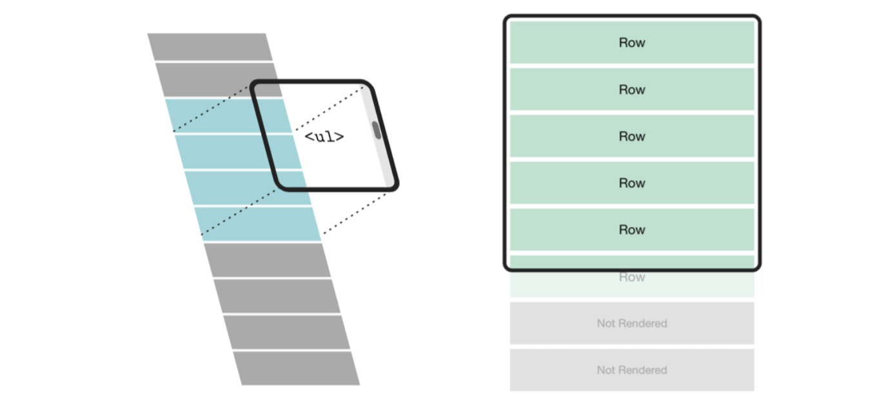
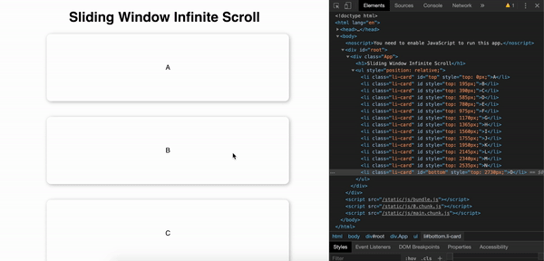

<br/>

*Infinite scrolling* is where we load a part of the result up front, and on reaching the end of the loaded list we load the next set of results and so on.

##So what is the problem?

Let us say that there is a list with 10,000 elements, say each element is  displayed inside an `<li>` tag. So when we reach the end of the list then there will be 10,000 `<li>` nodes attached to the parent.

In case of complex `<li>` with more number of children inside it , this will cause a huge hit in the website's performance and also affects scrolling performance of the webpage.

##How to overcome this overloaded DOM size?

- It can be overcome by *Unloading* or *discarding* the top `<li>` which are not part of the user viewport.
- (i.e) As and when the user scrolls down we start adding the new rows and should delete the existing rows which are above the fold.
- We will be achieving this with fixed children size, say 15 rows max and we will update the same for new set of inputs thus maintaining a lower DOM size.

##Things to consider

- Adding new node to the bottom of the list should be done when the last element of the list enters the viewport.
- After adding the new elements to the DOM the existing elements should be deleted such that the deleted elements lies above the fold.(i.e) out of user's viewport.
- When the user scrolls up and reaches the top element then we should load the deleted top elements and should delete the bottom ones, which are below the viewport.

##What are we gonna Implement?
A Component that can render a list of n number of items with fixed window size of 15 elements.(i.e) At any time only 15 DOM nodes will be present even on infinite scrolling through `n` elements.

###Output


###Approach

- We are going to get some help from CSS in achieving this.(We will make use of CSS's Absolute positioning).

- Our Parent div which wraps all our element is going be of `relative` in position.

- All our children will be positioned `absolute`ly with respect to the parent div.

- We calculate the `top` for each of the child and apply it in style parameter of the `<li>`.

- At any given time we will maintain 15 `<li>` elements in the DOM maximum.


Note: For Simplicity, we are going to consider only fixed size `<li>` cases.


#Implementation

##Initialization

```jsx
import React from "react";
const THRESHOLD = 15;

class SlidingWindowScroll extends React.Component {
  constructor(props) {
    super(props);
    this.state = {
      start: 0,
      end: THRESHOLD
    };
    this.$topElement = React.createRef();
    this.$bottomElement = React.createRef();
  }
}
```

- We have created our `SlidingWindowScroll` component which has a state with `start` value and `end` value in it.
- `start` is the starting index of the list array which has to be loaded lazily on scroll.
- `end` is the last index of the list array.
- `THRESHOLD` gives the maximum number of `<li>` elements that should be present in the DOM.
- We create two refs:
   - `this.$topElement`, will point the first element(0th index) in the list item.
   - `this.$bottomElement`, will point the last element(14th index) in the list item.

- Whenever the new elements are added or deleted the refs has to be updated accordingly to point to the top and bottom of the presently rendered list.

##Render

```jsx
 getReference = (index, isLastIndex) => {
    if (index === 0)
      return this.$topElement;  // Attach this ref for first element
    if (isLastIndex) 
      return this.$bottomElement; // Attach this ref for last element
    return null;
  }
```

```jsx
render() {
    const {list, height} = this.props;
    const {start, end} = this.state;
    const updatedList = list.slice(start, end);
    const lastIndex = updatedList.length - 1;
    return (
      <ul style={{position: 'relative'}}>
        {updatedList.map((item, index) => {
          const top = (height * (index + start)) + 'px';
          const refVal = this.getReference(index, index === lastIndex);
          const id = index === 0 ? 'top' : (index === lastIndex ? 'bottom' : '');
          return (<li className="li-card" key={item.key} style={{top}} ref={refVal} id={id}>{item.value}</li>);
        })}
      </ul>
    );
  }
```
- We get the `list` and `height` from `props` and `start` and `end` of the list from `state`.
- `updatedList` gives the new set of elements to be rendered.
- `<ul>` is made `relative`.
- For each item in the list, we calculate it's `top` position from its relative parent.
- It is calculated by the position of the current item in the `list` (index + start) multiplied by `height` of each element.
- `refVal` gives the `ref` that has to be attached. It will have reference to `this.$topElement` in case of index 0 and reference to `this.$bottomElement` in case of last index.
- We attach `id` with value `top` for first element and `bottom` as id for last element.


## Setting up the Observer for refs

```jsx

  componentDidMount() {
    this.intiateScrollObserver();
  }

  componentDidUpdate(prevProps, prevState) {
    if ((prevState.end !== this.state.end) || (prevState.start !== this.state.start)) {
      this.intiateScrollObserver();
    }
  }

```
- On `Mounting` and on whenever the value for `start` or `end` changes the `ref` which points to the top and bottom of the rendered `<li>` is changed.
- Since the `ref` starts pointing to different element we will have to listen to those two refs to know when they come into viewport.

We use `IntersectionObserver` to identify if the `root` or `bottom` element is in the viewport.


```jsx
intiateScrollObserver = () => {
    const options = {
      root: null,          // To listen to window scroll
      rootMargin: '0px',   // if there is any margin associated with it
      threshold: 0.01      // if 1% of the element is in view
    };
    this.observer = new IntersectionObserver(this.callback, options);
    if (this.$topElement.current) {
      this.observer.observe(this.$topElement.current);
    }
    if (this.$bottomElement.current) {
      this.observer.observe(this.$bottomElement.current);
    }
  }
```
- We create our `IntersectionObserver` with a `callback` that should get *fired when the elements enters and leaves* the viewport and `options`
- In `options` we specify that we are listening to the scroll event in window and the element should be marked as visible even when 1% of the element comes into view(by means of `threshold` key).
- Then, we observe both the refs (`this.$topElement` and `this.$bottomElement`) to know when it enters/ leaves viewport.

##Handling viewport entry of `<li>`

```jsx
callback = (entries, observer) => {
    entries.forEach((entry, index) => {
      const listLength = this.props.list.length;
      const {start, end} = this.state;
      // Scroll Down
      // We make increments and decrements in 10s
      if (entry.isIntersecting && entry.target.id === "bottom") {
        const maxStartIndex = listLength - 1 - THRESHOLD;     // Maximum index value `start` can take
        const maxEndIndex = listLength - 1;                   // Maximum index value `end` can take
        const newEnd = (end + 10) <= maxEndIndex ? end + 10 : maxEndIndex;
        const newStart = (end - 5) <= maxStartIndex ? end - 5 : maxStartIndex;
        this.updateState(newStart, newEnd);
      }
      // Scroll up
      if (entry.isIntersecting && entry.target.id === "top") {
        const newEnd = end === THRESHOLD ? THRESHOLD : (end - 10 > THRESHOLD ? end - 10 : THRESHOLD);
        let newStart = start === 0 ? 0 : (start - 10 > 0 ? start - 10 : 0);
        this.updateState(newStart, newEnd);
      }
    });
  }

```
- Whenever `this.$topElement` or `this.$bottomElement` comes into viewport or leaves the viewport `callback` will be called.
- `entries` is an array with all observers in the order of creation.
- `entries` in our case will have `this.$topElement` and `this.$bottomElement`.
- `isIntersecting` property gives if the element is in viewport and `id` helps us in deciding if it is the bottom element that came into view or the top one.
- We make calculation to maintain 15 elements between `start` and `end` of the `state`.
- We add and remove items in number of 10 and we make sure atleast 15 elements are present.
- Finally, we update `state` with new values for `start` and `end`.

##Updating State

```jsx
resetObservation = () => {
    this.observer.unobserve(this.$bottomElement.current);
    this.observer.unobserve(this.$topElement.current);
    this.$bottomElement = React.createRef();
    this.$topElement = React.createRef();
  }

  updateState = (newStart, newEnd) => {
    const {start, end} = this.state;
    if (start !== newStart || end !== newEnd) {
      this.resetObservation();
      this.setState({
        start: newStart,
        end: newEnd
      });
    }
  }
```
- We set the `state` with new values and also reset all the observer.
- While resetting, all the observers should be made `unobserve` to not to observe it's change in the future. And we create a new `ref` for `this.$bottomElement` and `this.$topElement`.

Now on scroll we have only 15 elements at a time but giving the user the sense of having it all in the DOM.

Have a unique key to avoid re-rendering of same `<li>`s.

###Output


Edit in CodeSandBox below.
[](https://codesandbox.io/s/zealous-firefly-5r7ie?fontsize=14)

That's All Folks!