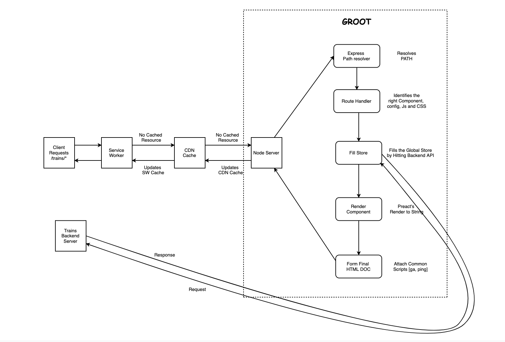
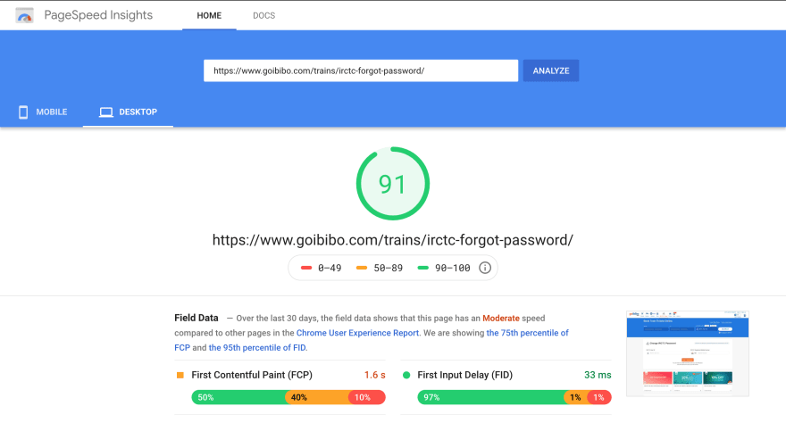
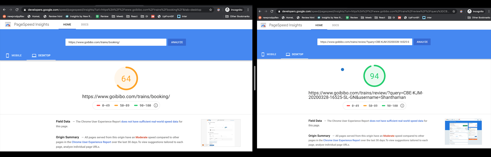

<br/>

Hello Fellow Devs,


 [Goibibo](https://www.goibibo.com/) is one of the top Online Travel Agent company for booking tickets Online for Flights, trains, bus, cars and hotels in India. In this I am gonna take you through the journey of building [goibibo trains](https://www.goibibo.com/trains/) vertical from the scratch.

Our Trains Funnel has 3 Main Pages:

| | Page Name | Purpose |
| --- | --- | --- |
| 1 | Home | To feed in Source, destination and date for travel |
| 2 | Results | To see the available trains List |
| 3 | Review | To avail offers and provide traveller details |


Payment(Mudra) is an independent service which is handled by landing the user in a different URL.

##Problems we had:

* **Feature Parity**:
Although our API provided a lot of information, they were not consumed at the Client. Due to this there was no parity in features between Mobile apps and Web Apps which led to much plain UI with no option event to filter items for example.

* **Hard to Read/Edit Existing Code:**
 For someone who came into `redux-saga` from `redux` for global state management, it was still hard to wrap my head around the concept of how redux-saga's `generators` work and how internally they are coupled with `watchers`. Every time I touch the code on `saga` I had to be extra careful also it uses local storage to maintain store.

* **No Shareable URL(Review Page):**
Our Review page's URL is static (`/trains/booking`) which made it impossible to share it across to someone else in the web. Because it was built with (Android/IOS) APP first approach.

* **Better User Experience**:
Sometimes users were not sure about what the mandatory Info they were missing to proceed further because of lack of appropriate messages.

* **Size:**
So the Elephant in the room was the **JS bundle Size**. Our vertical was a [Single Page Application](https://en.wikipedia.org/wiki/Single-page_application) and as you know we ended up downloading all javascript content up front on page 1 for the rest of the two pages as well. So the Initial sizes were as below:

JS:

| | File Name | Size | Compression |
| --- | --- | --- | --- |
| 1 | `vendor.js` | 144KB | Brotli |
| 2 | `bundle.js` | 46KB | Brotli |
| 3 | `review.js` | 14.4KB | Brotli |
|  | `total`  | 204.4KB | |

[JS browser Info](1.png)

CSS:

| | File Name | Size | Compression |
| --- | --- | --- | --- |
| 1 | `combinedStyles.css` | 22.8KB | gZip |
| 2 | other Css Files | 27.3KB | gZip |
|  | `total`  | 50.1KB | |

[CSS browser Info](2.png)

This resulted in considerable amount of users dropping off from our funnel without getting the javascript downloaded.

##Steps taken to resolve all the issues listed above:

**Feature Parity:**
 Since a lot of Information are already available in the API and just not Integrated, we went ahead with providing Feature Parity to the Existing Dweb of trains with (Offers Carousel, Filters, Best Available Class, Alternate Train Route, Smart Engage, Offers).With this our Average daily booking jumped from `200-300` to `600-700` on a daily basis.


**Rewrite Train in a Better lightweight framework**
We had to get React out of the picture because  just to show a `hello World` we'll end up sending around `40KB` to the Client.

(`react` - `2.6KB` and `react-dom` - `36KB`)

### **Our Rewrite framework Options:**

**1.No Framework:**
Maintaining a e-commerce website in plain JS has its own Pain Points with everyone coding in their own way (functional, object oriented, Es6) which ends up having no uniform way of writing the code. Also updating the DOM wont be as optimised as compared to frameworks like (react).

**2.Svelte:**
We were right on the current trends and noticed about Svelte and its ability to send compiled code as output. So, we ended up doing a POC on `Svelte` for our `Search` component in `Home` page and we found that the total amount of code that is shipped to the client is less than 10KB for the Search Widget which in turn is 45+KB in `react`.


**3.Preact:**
`preact`[3KB] is a lightweight `react` as they call it and it also has support for `Hooks` with `preactX` release. So a POC on that ended up with size a little higher(2KB) than Svelte.


**Final Verdict:**

Since 'Preact' and 'Svelte' were so close to our requirement of achieving lightest client bundle, we decided to choose between these two frameworks.

| | Metrics | `preact` | `svelte` |
| --- | --- | --- | --- |
| 1 | Size |  ~4.5KB (with Hooks) | Although it compiles the code to plain js, it adds a small amount of Svelte framework specific code (~2KB) |
| 2 | Community | Better than Svelte |  Relatively new and Growing |
| 3 | Package Availability |  All `react` and `preact` Frameworks are supported in `preact` | Not much option in terms of package availability |
| 4 | Skillset of Developers | Abundance | Need time to get into Svelte Ecosystem |
| 5 | BoilerPlate | Comparatively More Boiler Plate | Lesser Boiler Plate with the help of 2 way Binding|

**Note**: These were the data at the Time of deciding framework

With all those comparisons we decided on going with 'preact' as it is not much of size difference when compared with svelte and the community and packages availability are too good.

##**Enter groot**


- `groot` - our new repo.

###Motto of `groot`:

**1.Lightweight**
Our key metric was to serve the entire Funnel in Under 100KB.(All 3 pages included)

**2. MPA**
We decided on following Multi Page Application Approach as the extra byte of code to download on each page transition could go to maximum of only 20KB.The other resources which are common like `vendor.js` are served from service worker for each page except for the first time.

**3.Server Side Rendered**
Like any other vertical in goibibo, trains will be `Server Side Rendered` for providing the User with Meaningful First Paint as well as helping in SEO Indexing.

**4.IsoMorphic**
 The content will be `Server Side Rendered` with the same page being used in the funnel as well as for the SEO pages.(This ensures feature parity and avoids multiple team handling multiple versions of the same page).

**5.Packages**
Do not add package unless it is absolutely needed. Always prefer native solution.

**6.State Management**
We decided on leveraging the built-in `useReducer` hook combined with `useContext` to serve as global State management for our Application.And this helps us reducing the need for yet another third part library like  `redux`.

**7.No Axios**
We have decided on not using Axios as it contributes to (4.4KB gzip) and use `fetch` instead. However we used `node-fetch` for fetching on server.


Our client had only the following content in our vendor.

``` js
  "dependencies": {
    "preact": "10.0.0",                          
    "react-foco": "^1.3.1",                     
    "siema": "1.5.1",
    // Other Server dependencies     
  }
```
Very Little Client Dependencies? Oh yes!


###App Architecture:



Getting our First Page out:

 **Irctc forgot password**

- We began with preact's scaffold as it has optimised webpack build.
- But it always appended the whole preact component to the FirstChild of the body, but we needed `goibibo header` which is a plain JS component to be the first child.
- We could not export the `webpack`'s config out of the scaffold so we wrote our webpack config from scratch which gave more control in terms of build outputs.

**The CSS Problem:**
 We got our designs and implemented the functionality.When it was time to take the release out we noticed that our CSS for that page is about **26KB** because we used a generic css file known as `combinedStyles.css` which has a lot of CSS rules that are shared between all verticals but most of them were not used in our particular page.

### [`purify-css`](https://www.npmjs.com/package/purify-css) to the rescue:
This library creates a new file which contains css rules only for those classes that are used in our code base.

So I created a new webpack plugin out of purify Css.

```js
   plugins: [
        new OptimizeCssPlugin(
          [
            {
              files: ['./src/*/*.js', './src/*/*/*.js', './server/*.js', './server/*/*.js', './server/*/*/*.js', './plain_js/*.js'],
              cssPath: `https://goibibo.ibcdn.com/styleguide/css/newtrains/trainCombined.${Math.ceil(Math.random()*1000)}.css`,
              downloadCssPath: `./static/trains-static/styles/combinedStyles.css`,
              outputCssPath: `./static/trains-static/styles/purified.css`
            }
          ]
        )
     ]
// other configs

```

| | Property | Purpose |
| --- | --- | --- |
| 1 | `files` | js/css/html files to consider in my repository |
| 2 | `cssPath` | The giant file with all CSS rules |
| 3 | `downloadCssPath` | If `cssPath` file is in remote server, then `downloadCssPath` is where it will get downloaded. |
| 4 | `outputCssPath` | It is the location of the final output CSS file which takes the CSS rules from `cssPath` file for the classes mentioned in files provided under `files` |

This worked out ultimately and resulted in reducing the size of the `combinedStyles.css` from `23KB` to `~7KB`.

Finally, with the success in that we also involved in serving the content in `brotli` compression rather than `gzip` which also helped us in reducing the resource size. We did have our Fallback to gzip for the user agents that does not support `br` compression.

| | File Name | gzip | brotli |
| --- | --- | --- | --- |
| 1 | `vendor.js` | 17.7KB | 15.7KB |
| 2 | `forgotPassword.js` | 14.3KB | 12.3KB |
|  | `total`  | 32KB | 28KB|

[Forgot Password](https://www.goibibo.com/trains/irctc-forgot-password/) is the first page that we built and is live with a pretty good `LightHouse` Score of `91`.




Post that we released multiple URLs which are relatively New.


 As the results were Satisfactory for the pages outside the main funnel, we moved one of the pages inside our funnel to be served from `groot`.

**The REVIEW Page:**

Review page is the first in funnel page we decided to rewrite in `groot`. 

This involved,
- Considerable changes in the `Backend API` to support `page refresh` and other train specific use cases as to show offer, updated fare breakup etc.
- Design changes
- Additional features
- Responsive
- Better UI Error handling


Since we wanted to provide the Server rendered Meaningful response on review landing rather than a `loading shimmer`,
 - We hit the `Backend API` from our Node Server in `groot`
 - Updated our `Store`
 - Server rendered our Component
 - Attached Additional scripts, css required to the final HTML Doc
 - `Hydrated` on Client on receiving Response.


And we were able to see considerable improvement in terms of performance.



##Review Page Comparison:
| | `Metric` | `Old Version` | `New Version` | `Diff` |
| --- | --- | --- | --- | --- |
| 1 | JS Vendor Size | 144KB | 16KB | ~85% Reduction |
| 2 | JS Main Bundle Size | 60.4KB | 19.5KB | ~67% Reduction |
| 3 | CSS Size | 50.1KB | 11KB | ~78% Reduction |
| 4 | LightHouse Score | 64 | 94 | ^30 Points |

Well!!!


Since Common assets are cached by `service worker`, moving from one page to the other will download only the page specific `js` file from server.

