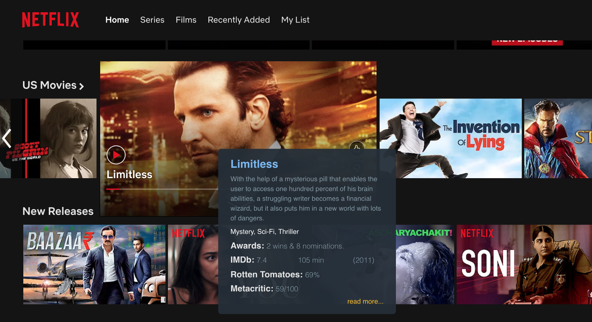
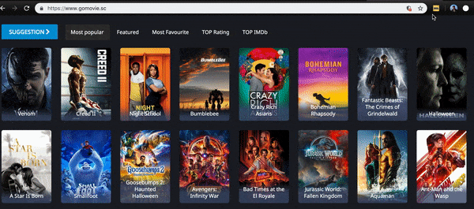

<br/>

Please read Part-I [here](/imdb-extension-part-1) for continuity.
###Step 4: Initiating listener in the DOM through content.js
```js
/* Mouse over Event handler */
function listenToMouseover() {
  loadCssToHead();
  window._imdb_minWaitfBeforeExecute = undefined;
  document.body.addEventListener("mouseover", function(e) {
    var x, y;
    e = e || window.event;
    x = e.clientX;
    y = e.clientY;

    /* Avoid Recognizing words inside callout || _imdb_calloutElt => callout Element */
    var calloutPositions = typeof(window._imdb_calloutElt) !== 'undefined' ? window._imdb_calloutElt.getBoundingClientRect(): {};
    if (typeof(window._imdb_calloutElt) !== 'undefined' && x <= (calloutPositions.width + calloutPositions.left) && x >= calloutPositions.left && y <= (calloutPositions.top + calloutPositions.height) && y >= calloutPositions.top) {
      return;
    }
    /* Debounce Start */
    clearTimeout(_imdb_minWaitfBeforeExecute);
    _imdb_minWaitfBeforeExecute = setTimeout(findIMDB.bind(this, x, y), 250);
    /* Debounce End */
  });
}
```
When the user clicks on the Extension we called the`listenToMouseover()` function.

* `loadCssToHead` appends css to head.[Try this as an Exercise] (We do it here because it does not load our css when the user did not intend to activate our extension)
**Also, make sure your Element’s class Names that you set are unique and does not overlap with the Webpage’s existing class names.**

* We add an event listener for`mouseover` on document body.
* When the user moves the pointer, get the Mouse pointer coordinates [line 8 and 9].
* We will be opening a popup on success. We don't want our Extension to recognize texts inside the popup. So, we add the logic to avoid it.[line12–15]
* `mouseover` is an expensive event like`scroll` which gets fired numerous times even for a small movement. So, to avoid it we are checking if the mouse at least rests 250ms on a coordinate before we start finding the IMDb[line 17 and 18]. Read about debounce in javascript here.
* When the user is on a coordinate for more than 250ms then we try finding the IMDb through`findIMDB()` function by passing the coordinates as arguments.

###Step 5: Find the text inside the hovered element

```jsx
function findIMDB(x, y) {
  var element = document.elementFromPoint(x,y);
  var text = '';
  // NETFLIX Specific changes
  if (window.location.href.includes('netflix.com/browse') && element.classList.value === "bob-play-hitzone") {
    text = element.parentElement.children[2].getElementsByClassName('bob-title')[0].innerText.trim();
  } else {
    text = (element && element.innerText) ? element.innerText.trim() : '';
  }
  
  /* Check if Previous text found is not equal to Current Text found and Text length less than 35 to avoid big sentences from Recognizing */
  if (text && window._imdb_finderText !== text && text.length < 35) {
    window._imdb_finderText = text;
    chrome.runtime.sendMessage({
      type: 'callAPI',
      text: text
    });
    window._imdb_posx = x;
    window._imdb_posy = y;
    console.log("Message Sent: " , text);
  }
}
```
`document.elementFromPoint(x, y)` helps us find the DOM element in the given x and y coordinates.

* Lines 5 and 6 include changes specific to Netflix where the element variable does not give the actual text due to overlay.
* Once we get the element we find the`innerText` and store it to a variable.[Line 8]
* Its unnecessary API calls that we will make if the user hovers on a long sentence, so we limit the text to 35 it can be more than 35 as it breaks for cases where the movie name is longer than 35 :P [Line 12]
* If we get a text then we send a message to`background.js` [line 14 -17] to call the API and get the response back. We can also make calls in content js but I chose to do it in background script.
* Set Window variables for values of x and y for which call is made. So that we can add our popup there[Line 18 and 19] on getting a response.[which we will cover shortly]

###Step 6: Call IMDb API from background.js

```js
chrome.runtime.onMessage.addListener(function(request, sender, sendResponse) {
  if (request.type == "callAPI") {
    getIMDBRating(request.text).then(function(response) {
      data = JSON.parse(response);
      if (!data.Error) {
        data.type = 'ratingResponse'
        chrome.tabs.query({active: true, currentWindow: true}, function(tabs) {
          chrome.tabs.sendMessage(tabs[0].id, data)
        });
      } else {
        console.log('No movie Found');
      }
    });
    return true;
  }
});

function getIMDBRating(text) {
  return new Promise(function(resolve, reject) {
    var xhttp = new XMLHttpRequest();
    xhttp.onreadystatechange = function() {
      if (this.readyState == 4 && this.status == 200) {
       return resolve(this.responseText);
      }
    };
    var urlParam = text.split(" ").join('+');
    xhttp.open("GET", _imdb_api_url + urlParam + _imdb_apikey, true);
    xhttp.send();
  });
}
```
We have a Message listener in background.js which gets executed on receiving a message form content.js

* Type is`callApi` which we are passing from content.js
* The`getIMDBRating()` function makes API call and gets the response.
* The API URL and the API key are hidden by the way. You can get one for yourself over [here](http://www.omdbapi.com/).
* Send the response as a message to the tab that sent the message to background js to make a API call[line 7–9]

###Step 7: Loading the popup
```js
function hasGotMessage(response, sender, sendResponse) {
  switch (response.type) {
    case 'clickResponse':
      window.sessionStorage.setItem('_imdbRaterEnabled', "1");
      listenToMouseover();
      break;
    case 'ratingResponse':
      loadCallout(response);
      break;
  }
}

function loadCallout(data) {
   if (window._imdb_calloutShown) {
    removeCallouts();
  }
  /* Popup rendering Start */
  var innerComponents = getInnerComponentHTML(data);
  /* parent div start*/
  var imdbElement = document.createElement('div');
  imdbElement.style.position = "relative";
  imdbElement.className = "_imdbClass";
  imdbElement.innerHTML = innerComponents.absElt + innerComponents.title + innerComponents.plot +
                          innerComponents.genre + innerComponents.awards+ innerComponents.line1 + innerComponents.rottenTomatoes +
                          innerComponents.metacritic + innerComponents.readMore +'</div>';
  /* parent div end */
  var childElt = imdbElement.children[0];
  findRefinedXandYcoordinates();
  childElt.style = 'position: fixed;top: ' + _imdb_posy + 'px; height: ' + 250 + 'px; left: ' + _imdb_posx + 'px;display: flex;flex-direction: column;justify-content: space-around;';
  document.body.append(imdbElement);
  /* Render Callouts End */
  window._imdb_calloutShown = true;
  window._imdb_calloutElt = childElt;
  window.onscroll = removeCallouts;
}
```
background.js on sending the response as the message to content.js we identify the type and call`loadcallout()` function.

We remove the existing popup if there is any[line 14–16]. Also on scroll [line 34]. Identify them through the parent class name or id of your callout element.[Try implementing this as an exercise]
Pass response to`getInnerComponentHTML` which will put required HTML templates as strings along with placing response data in the appropriate place. Then load the element to the DOM by appending it to the body directly and making it **fixed and give top and bottom same as the place where the cursor was placed at the time of making API call.**

> ***NOTE:*** *We make it fixed and append directly to the body. Helps in avoiding overlay.*

* `findRefinedXandYcoordinates()` helps in calculating new coordinate if the movie name is displayed at corners. (Can be done by reducing x or y’s coordinate by the width of your popup).

If you have made it this far you should be having a working IMDb on hover Extension :)



## Thats all Folks :)