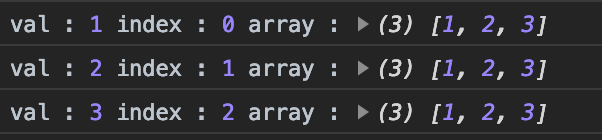
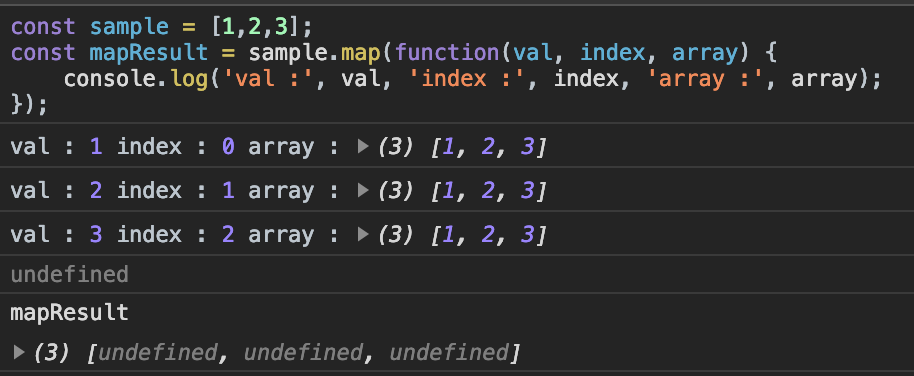
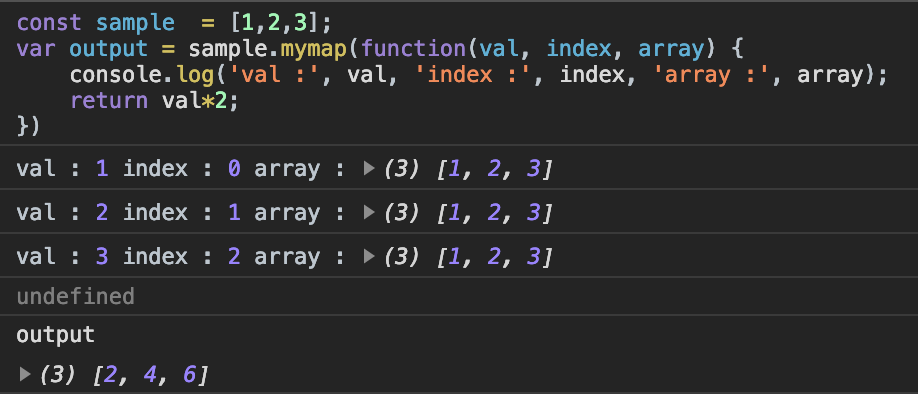

<br/>

If you know how`Array.map()` works you can jump [here](#map_implementation) directly.

##What is Array.map in javascript?
    A map is a built-in function of Arrays in javascript which helps us iterate over each individual elements of the array and returns a brand new array.


First let us understand how map behaves,

For Example:
``` js
const sample = [1,2,3];
const mapResult = sample.map(function(val, index, array) {
    console.log('val :', val, 'index :', index, 'array :', array);
    return (val * 2);
});
```
The output of the above snippet will be:



So, we can conclude that, for **each value** of the array the function gets executed. And the function has access to 3 arguments:
* The current element that is processed
* Current element's index
* Entire Array

We are returning`val*2` on every iteration and that gets stored in`mapResult`.
So,`mapResult` has [2,4,6] in it and this wont modify the original array`sample`.

Thus, whatever that is returned by map during each iteration, will get stored inside a brand new array and the original array remains untouched.

> Note: If nothing is returned from the function then`undefined` gets stored in the output array.And this array's length will be same as that of the array on which map is done.

If we did not return anything in our previous example then,



`map` will always return an **array**.So we don't have to write an explicit return from an Array.map function which is why we use map most of the times to iterate through lists in React.

##<a name="map_implementation"></a>Lets create our own map method[mymap]

###Step 1:
* We will create a new method[mymap] which allows us to use`Array.mymap()`
* In order to use Array.mymap() we have to have`mymap()`'s definition in Array.prototype.

``` js
Array.prototype.mymap = function(){

}
```
Now we will be able to run`[1,2,3].mymap();` which will return`undefined`.

###Step 2:
* `map` is called with function as an argument inside it. (eg:`[1,2].map(function(val, index, arr){})`). So, our`mymap` function should accept a function as an argument.
* The function in the argument should be called for each value in the array with 3 arguments:
    * The current element
    * Current element's index
    * Entire Array
* `this` refers to the **array** on which`mymap` is done. `this` is the array itself.

``` js
Array.prototype.mymap = function(callback) {
    for (let index = 0; index < this.length; index++) {
        callback(this[index], index, this);
    }
}
```
###Step 3:
* Finally, we output the result to a new array and return them.

``` js
Array.prototype.mymap = function(callback) {
    const resultArray = [];
    for (let index = 0; index < this.length; index++) {
        resultArray.push(callback(this[index], index, this));
    }
    return resultArray;
}
```
###Output:



Thats it :) we have implemented our version of`map` method.


Share if it helped you :)

Next step: Try using similar approach and create a custom map for objects.
