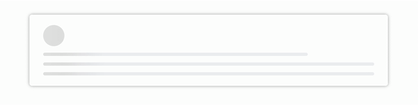

When I heard the word **Loading Shimmer** I thought that is some new Cool stuff got introduced in Web Development. But it Turns out it is something that we have already noticed in our day to day web browsing.

When the DOM content is taking time to load due to slower Network, we used to show a loading icon/gif which indicates that the content is being loaded.
The OldSchool way of showing a loader:


The above case works well to let user know that the content is being loaded. 
But, it is not a Great User Experience.
So, how do we achieve a better User Experience?


###Skeleton Screens to the Rescue.


Instead of showing a loading icon we could have a sample layout of our app which indicates how and where our content gets placed when that is fully loaded.

Like the following in Facebook


This is the **"Loading Shimmer!"**


The above layout consists of a separate sections to indicate Profile Picture, description and captions. A generic template which can be shown while the content is loading.

##Let us Learn How to achieve this in our app

We shall implement the complete code for it with just CSS and HTML.

Full Code is available in [codepen](https://codepen.io/dhilipkmr/pen/xejEBa)

Output:



##The Boiler Plate:

The following HTML includes a layout which has a **profile pic** and few **comments.**

``` jsx
<div class="card br">
   <div class="wrapper">
      <div class="profilePic animate"></div>
      <div class="comment br animate w80"></div>
      <div class="comment br animate"></div>
      <div class="comment br animate"></div>
   </div>
<div>

```

``` css
.br {
  border-radius: 8px;  
}
.w80 {
   width: 80%;
}
.card {
  border: 2px solid #fff;
  box-shadow:0px 0px 10px 0 #a9a9a9;
  padding: 30px 40px;
  width: 80%;
  margin: 50px auto;
}
.profilePic {
  height: 65px;
  width: 65px;
  border-radius: 50%;
}
.comment {
  height: 10px;
  background: #777;
  margin-top: 20px;
}


```

`.card` class gives card like background.


##Expanding animation:

``` css
.wrapper {
  width: 0px;
  animation: fullView 0.5s forwards linear;
}

@keyframes fullView {
  100% {
    width: 100%;
  }
}
```

- `.wrapper` has a custom **Expanding** animation in which we increase the width from 0 to 100% while showing the shimmer.


##The Shimmer:

``` css
.animate {
   animation : shimmer 2s infinite;
   background: linear-gradient(to right, #eff1f3 4%, #e2e2e2 25%, #eff1f3 36%);
   background-size: 1000px 100%;
}
```

`.animate` class has a custom animation by name 'shimmer', duration 2 seconds, count of infinite (keeps repeating).

* `background` is a `linear-gradient`.We need to use a gradient as it merges with the rest of the colour in its front and back.

* Here we indicate that there is a gradient from left to right and the colour between 25% is `#e2e2e2` (darker shade) and in all other places (o to 4% and 36% to 100%) it is `#eff1f3`(actual bg color)

* `background-size` helps in providing the `width` and `height` for the background.


``` css
@keyframes shimmer {
  0% {
    background-position: -1000px 0;
  }
  100% {
    background-position: 1000px 0;
  }
}
```

* In our custom `shimmer` animation we define how it should appear at the beginning of the animation and at the end of the animation.
* So, the background's position is being moved from negative maximum of its width to the positive maximum.
* Since we used `infinite` it keeps happening for every given duration (2s).

Don't forget to tap on the `follow` button :P

Full Code is available in [codepen](https://codepen.io/dhilipkmr/pen/xejEBa)

That's All Folks :)

